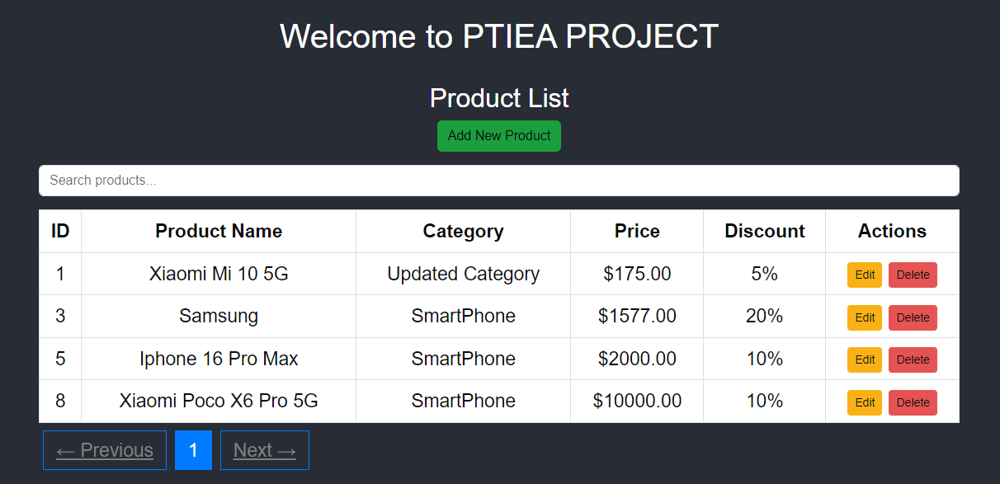
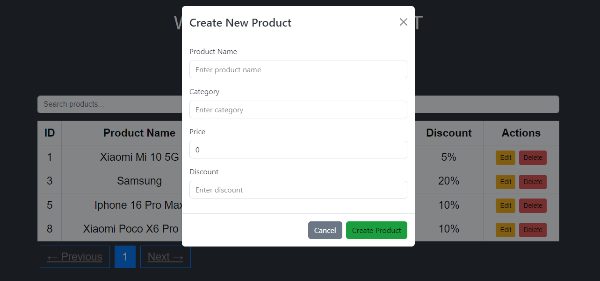
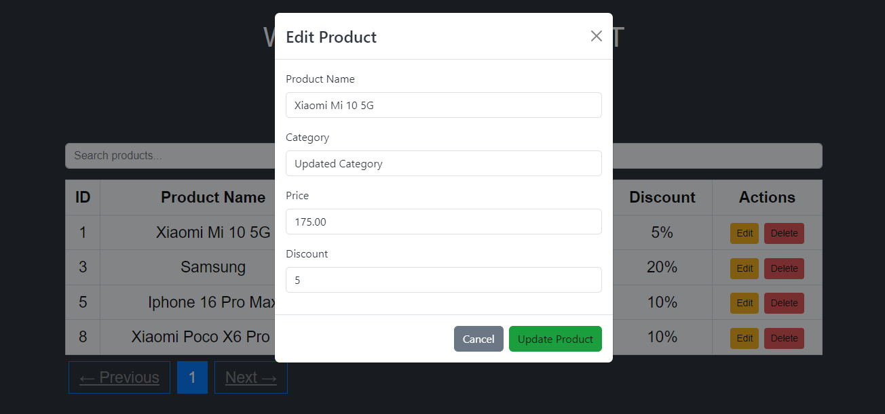

# PTIEA Project

Welcome to the **PTIEA Project** repository! This project is a [React](https://reactjs.org/) application developed to manage and display products with features like **CRUD operations** (Create, Read, Update, Delete) and a modern UI utilizing **DataTables** for data representation.

## Features

- **Product Management**: Easily add, edit, and delete products.
- **DataTables Integration**: Interactive table with pagination, sorting, and filtering options.
- **Bootstrap UI**: Clean and responsive design using [Bootstrap](https://getbootstrap.com/).
- **CRUD Operations**: Manage products with intuitive forms and dynamic updates.
- **React-Bootstrap Modals**: Beautiful and user-friendly modals for confirmation and data editing.
- **Toast Notifications**: Real-time feedback for actions like product creation, updates, and deletions.

## Technologies Used

- **Frontend**: [React](https://reactjs.org/) with [TypeScript](https://www.typescriptlang.org/)
- **Styling**: [Bootstrap](https://getbootstrap.com/) & [React-Bootstrap](https://react-bootstrap.github.io/)
- **Table**: [React Data Table Component](https://www.npmjs.com/package/react-data-table-component)
- **State Management**: React's useState and useEffect hooks
- **Notifications**: [React-Toastify](https://fkhadra.github.io/react-toastify/)
- **Backend**: [Laravel](https://laravel.com/) for RESTful API (if applicable)

## Installation

To run this project locally, follow these steps:

### Prerequisites

- Node.js installed (v14.x or later)
- npm or yarn installed
- Git installed

### Steps

1. **Clone the repository**:
   ```bash
   git clone https://github.com/ergyramadhan/ptiea-project.git
   ```

2. **Navigate to the project directory**:
   ```bash
   cd ptiea-project
   ```

3. **Install dependencies**:
   ```bash
   npm install
   ```

4. **Start the development server**:
   ```bash
   npm start
   ```

   The app will be running at `http://localhost:3000/`.

## Usage

### Adding a Product

1. Click the **Add New Product** button.
2. Fill in the product name, category, price, and discount.
3. Click **Create Product** to save the product.

### Editing a Product

1. Click the **Edit** button next to a product.
2. Update the product information in the form.
3. Click **Update Product** to save changes.

### Deleting a Product

1. Click the **Delete** button next to a product.
2. Confirm the deletion in the modal.

## Screenshots





*Product list with CRUD operations and DataTables integration.*

## Project Structure

```
├── public/
├── src/
│   ├── components/
│   ├── App.tsx
│   ├── index.tsx
│   └── ...
├── .gitignore
├── package.json
└── README.md
```

- **components/**: Contains reusable components like ProductList, Modals, and Forms.
- **App.tsx**: Main entry point of the application.
- **index.tsx**: Renders the React application into the DOM.

## Contributing

Feel free to submit issues or pull requests if you'd like to improve the project. Contributions are always welcome!

1. Fork the repository.
2. Create your feature branch: `git checkout -b my-new-feature`.
3. Commit your changes: `git commit -m 'Add some feature'`.
4. Push to the branch: `git push origin my-new-feature`.
5. Open a pull request.

## License

This project is licensed under the MIT License - see the [LICENSE](LICENSE) file for details.

## Contact

For any inquiries or suggestions, feel free to contact me at:

- **Email**: ramadhan.ergy@yahoo.com
- **GitHub**: [ergyramadhan](https://github.com/ergyramadhan)
