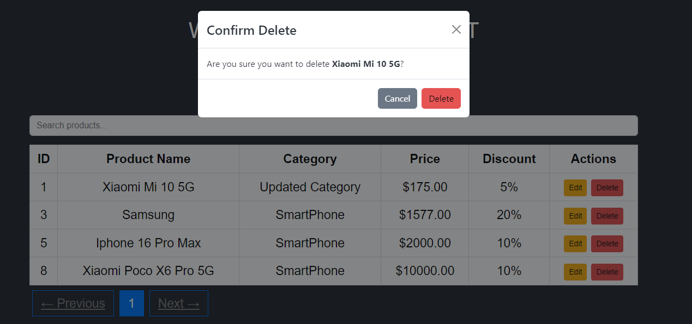

# PTIEA Project

Welcome to the **PTIEA Project** repository! This project is a full-stack application using **React** on the frontend and **Laravel** on the backend with **MySQL** as the database. It supports full **CRUD operations** (Create, Read, Update, Delete) for managing products, complete with a modern UI and data table representation.

## Features

- **Product Management**: Add, edit, and delete products.
- **DataTables Integration**: Interactive table with pagination, sorting, and filtering options.
- **Bootstrap UI**: Clean and responsive design using [Bootstrap](https://getbootstrap.com/).
- **CRUD Operations**: Manage products with dynamic updates.
- **React-Bootstrap Modals**: User-friendly modals for confirmation and editing.
- **Toast Notifications**: Real-time feedback for CRUD actions.
- **MySQL Database**: Manage product data with MySQL backend.

## Technologies Used

- **Frontend**: [React](https://reactjs.org/) with [TypeScript](https://www.typescriptlang.org/)
- **Styling**: [Bootstrap](https://getbootstrap.com/) & [React-Bootstrap](https://react-bootstrap.github.io/)
- **Table**: [React Data Table Component](https://www.npmjs.com/package/react-data-table-component)
- **State Management**: React's useState and useEffect hooks
- **Notifications**: [React-Toastify](https://fkhadra.github.io/react-toastify/)
- **Backend**: [Laravel](https://laravel.com/) for RESTful API
- **Database**: [MySQL](https://www.mysql.com/)

## Installation

### Prerequisites

- **Node.js** installed (v14.x or later)
- **npm** or **yarn** installed
- **Git** installed
- **PHP 7.4+** installed
- **Composer** installed
- **MySQL** installed

### Steps for Setting Up Backend (Laravel)

1. **Clone the repository**:
   ```bash
   git clone https://github.com/ergyramadhan/ptiea-backend.git
   ```

2. **Navigate to the backend directory**:
   ```bash
   cd ptiea-backend
   ```

3. **Install Laravel dependencies**:
   ```bash
   composer install
   ```

4. **Set up environment variables**:
   - Copy the `.env.example` file to `.env`:
     ```bash
     cp .env.example .env
     ```
   - Open the `.env` file and configure your **MySQL database** settings:
     ```dotenv
     DB_CONNECTION=mysql
     DB_HOST=127.0.0.1
     DB_PORT=3306
     DB_DATABASE=ptiea-project
     DB_USERNAME=root
     DB_PASSWORD=
     ```

5. **Generate application key**:
   ```bash
   php artisan key:generate
   ```

6. **Run the database migrations**:
   ```bash
   php artisan migrate
   ```

7. **Seed the database with sample data (optional)**:
   ```bash
   php artisan db:seed
   ```

8. **Start the Laravel development server**:
   ```bash
   php artisan serve
   ```

   The backend will run at `http://127.0.0.1:8000/`.

### Steps for Setting Up Frontend (React)

1. **Clone the repository**:
   ```bash
   git clone https://github.com/ergyramadhan/ptiea-frontend.git
   ```

2. **Navigate to the frontend directory**:
   ```bash
   cd ptiea-frontend
   ```

3. **Install frontend dependencies**:
   ```bash
   npm install
   ```

4. **Start the React development server**:
   ```bash
   npm start
   ```

   The app will be running at `http://localhost:3000/`.

### Connecting Frontend and Backend

Make sure the frontend is configured to make requests to the backend API. In the React app, typically in an API service file or `.env` file, set the API URL to the Laravel backend:

For example:
```js
const API_URL = 'http://127.0.0.1:8000/api/products/';
```

### MySQL Database Setup

1. **Install MySQL**: If MySQL is not already installed, download and install it from [MySQL's official website](https://www.mysql.com/downloads/).
2. **Create a new database**: After installing MySQL, create a new database for the project:

   ```sql
   CREATE DATABASE ptiea-project;
   ```

3. **Configure `.env` file** in the Laravel project with your MySQL credentials.

## Usage

### Adding a Product

1. Click the **Add New Product** button in the UI.
2. Fill in the product name, category, price, and discount.
3. Click **Create Product** to save the product.

### Editing a Product

1. Click the **Edit** button next to a product.
2. Update the product information in the form.
3. Click **Update Product** to save changes.

### Deleting a Product

1. Click the **Delete** button next to a product.
2. Confirm the deletion in the modal.

## Screenshots



*Product list with CRUD operations and DataTables integration.*

## Project Structure

```
├── ptiea-backend/        # Laravel API Backend
│   ├── app/
│   ├── database/
│   ├── routes/
│   └── ...
├── ptiea-frontend/       # React Frontend
│   ├── src/
│   ├── public/
│   └── ...
├── .gitignore
├── package.json
├── README.md
└── ...
```

## Contributing

Feel free to submit issues or pull requests if you'd like to improve the project. Contributions are always welcome!

1. Fork the repository.
2. Create your feature branch: `git checkout -b my-new-feature`.
3. Commit your changes: `git commit -m 'Add some feature'`.
4. Push to the branch: `git push origin my-new-feature`.
5. Open a pull request.

## License

This project is licensed under the MIT License - see the [LICENSE](LICENSE) file for details.

## Contact

For any inquiries or suggestions, feel free to contact me at:

- **Email**: ramadhan.ergy@yahoo.com
- **GitHub**: [ergyramadhan](https://github.com/ergyramadhan)
